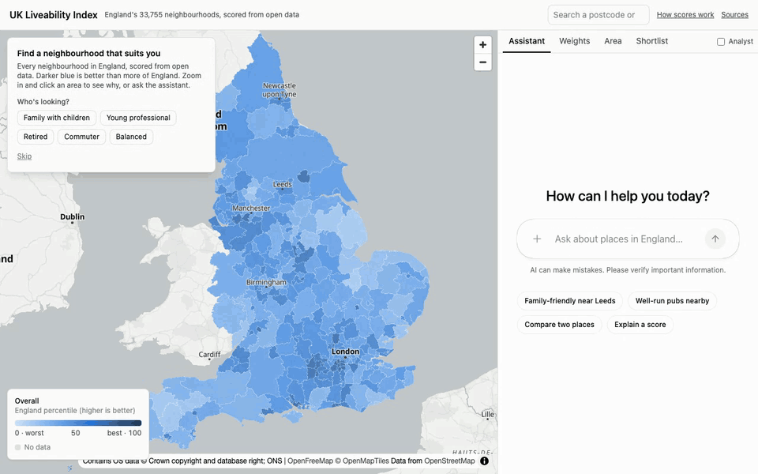
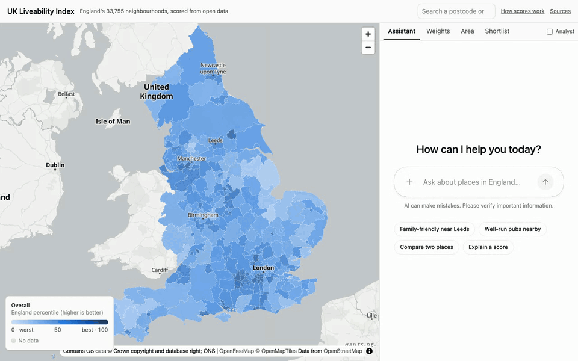
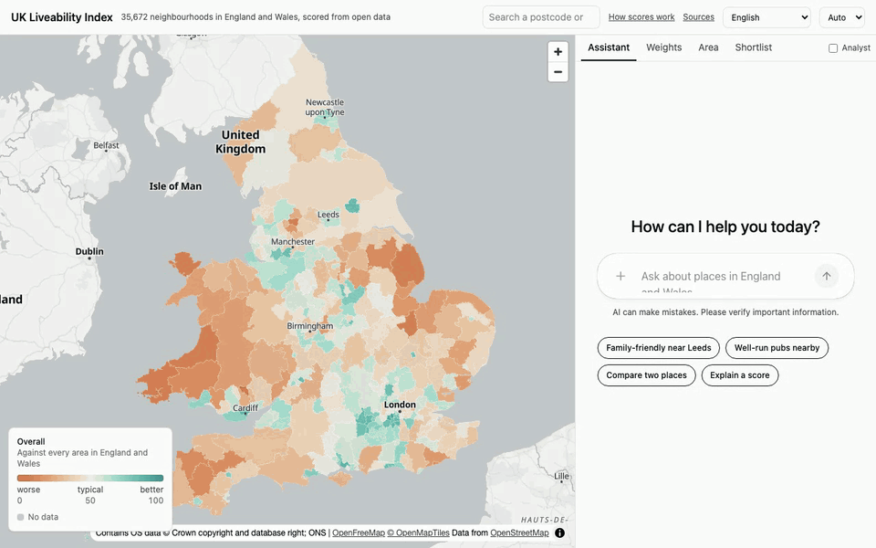
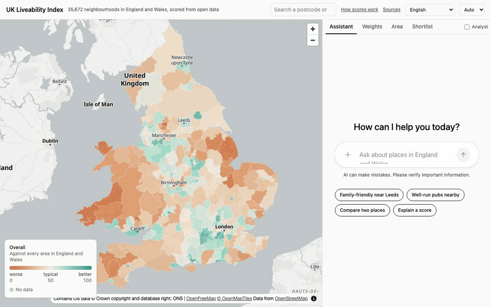

# UK Liveability Index

Every neighbourhood in England, scored from open data. Choose what matters to you (safety,
schools, green space, transport, pubs, prices…), see the whole country recolour, and ask an
assistant that answers with maps, profiles and comparisons instead of walls of text.



- **33,755 neighbourhoods** (2021 LSOAs, 1,000–3,000 residents each), scored 0–100 on eight
  themes from **about 40 open datasets**: police.uk, NHS, Ofsted, DfE, Land Registry, ONS,
  Defra air quality, Environment Agency flood risk, Ofcom broadband, bus timetables,
  OpenStreetMap and more.
- **Your weights, computed in your browser**, from five ready-made personas or any
  weighting of your own, with an honest range for how much a result depends on them.
- **An assistant that shows its working**, tested on 30 cases with three models, including
  that its replies only use numbers from the data ([evals](docs/evals.md)).
- **Open**: MIT code, open data under the ODbL, a documented and validated
  [method](docs/methodology.md). It runs on your own machine.

## Quickstart

You need [Docker](https://docs.docker.com/get-docker/) (with Compose), `make` and `curl`.
On Windows, use WSL (not tested yet).

```bash
git clone https://github.com/MysterionRise/uk-liveability-index.git
cd uk-liveability-index
make quickstart
```

That downloads the data pack (about 120 MB) and the app's images, and opens
http://localhost:3000. Stop it with `make down`.

**The assistant** needs a model key. Put an [OpenRouter](https://openrouter.ai) key in
`.env` (`make quickstart` creates it from [.env.example](.env.example)) and run `make up`.
Without a key, everything else works and the assistant answers its suggested questions
from recordings. See [Assistant](#assistant) for other providers and costs.

**Just a look?** `make up-demo` runs on the small dataset in the repo (Leeds and Brighton),
with no download.

## What you can do

**Search a postcode or place** to see its profile: the score on each theme against the
council and England medians, its strengths and weak spots, key facts, and how much the
result depends on the weights.



**Ask the assistant** to rank, compare or explain areas, or find well-run pubs, GPs and
schools nearby. Its answers are live components that move the map.



**Analyst mode** adds distributions, an overlap heatmap of the indicators, read-only SQL
over every neighbourhood and CSV export.



Also: a shortlist with side-by-side comparison, shareable links, light and dark mode,
and a phone layout. A full walkthrough video comes with each
[release](https://github.com/MysterionRise/uk-liveability-index/releases).

## How the scores work

Each neighbourhood gets 64 indicators. The 31 that count towards the score are turned into
0–100 scores against the rest of England, averaged within eight themes (safety, environment,
health services, schools and childcare, transport, amenities, housing and community), and
the themes are weighted by what you choose. The other indicators are shown for context, so
related measures aren't counted twice.

- **Fair to rural areas.** Access measures stop adding points beyond what a typical suburb
  has, and "compare like with like" ranks villages against villages.
- **Uncertain where it should be.** Nudging every theme's weight shows how stable a result is:
  "better than 72–95% of England" rather than a falsely precise 84%, and "close call" tags in
  rankings.
- **Checked.** A review of 25 contrasting places (49/49 checks, the key ones run on every
  build) is in [docs/validation.md](docs/validation.md).

The full method, including how Greater Manchester's missing crime data and Ofsted's
framework changes are handled, is in [docs/methodology.md](docs/methodology.md), and every
source with its licence and date is in [docs/data-sources.md](docs/data-sources.md).

## Assistant

The assistant runs on any model [Pydantic AI](https://ai.pydantic.dev) supports. The
default is Claude Haiku 5.5 through OpenRouter, with an open-weights model on another
provider as the fallback:

| Model (via OpenRouter) | Eval cases passed | Typical answer | Cost per question |
|---|---|---|---|
| Claude Haiku 5.5 (default) | 30/30 | 5 s | about $0.0014 |
| Qwen 3.8 27B (fallback, open weights) | 30/30 | 7 s | about $0.0045 |
| Claude Opus 5.5 | 30/30 | 7 s | about $0.04 |

Set `LIX_MODEL` in `.env` to use another: `anthropic:claude-opus-5-5`, `openai:gpt-5`,
`google:gemini-2.5-pro`, or a local model with Ollama (`ollama:llama3.1`,
`docker compose --profile local-llm`).

**Caps, so a key can't run up a bill.** By default: 30 questions per conversation, 20 a
minute and $1 of spend a day, plus limits on each question's model requests, tool calls and
tokens. A refused question gets a chat reply and the map keeps working. Change them in
`.env`, and also set a credit limit on the key itself.

The same tools are available to Claude Desktop and other clients over
[MCP](https://modelcontextprotocol.io) at http://localhost:3000/mcp/.

## Limitations

- **England only**, because the other nations publish different data.
- **Neighbourhoods, not streets.** Scores describe areas of 1,000–3,000 residents, and
  distances are straight-line.
- **Data has dates.** Each source has its own (shown in the app); this release's data was
  built on 7 October 2026. Crime in Greater Manchester is estimated, because its police
  force publishes none.
- **Judgement calls.** The weights, thresholds and choice of indicators are explained,
  not objective. Use the scores to explore, not as property, financial or legal advice.
- **Not yet included:** road and rail noise, surface-water flooding and tree cover.

## Building the data yourself

The `lix` pipeline rebuilds everything from the original publishers: about 20 GB of
downloads, then staging, indicators, scores and map tiles.

```bash
make install       # uv sync (needs uv and Python 3.11)
make build-data    # fetch, stage, indicators, score, tiles, validate
make up BUILD=1    # build the images from this checkout
```

How the pipeline, API, assistant and front end fit together, and how to run their tests,
is in [docs/development.md](docs/development.md).

## Contributing

Issues and pull requests are welcome; see [CONTRIBUTING.md](CONTRIBUTING.md). Report
security problems privately ([SECURITY.md](SECURITY.md)).

## Licence

- **Code:** MIT ([LICENSE](LICENSE)).
- **Data:** the data pack is built from open data and released under the Open Database
  Licence because part of it comes from OpenStreetMap ([DATA-LICENCE.md](DATA-LICENCE.md)).
  Reuse must keep the notices in [ATTRIBUTION.md](ATTRIBUTION.md).

Contains public sector information licensed under the Open Government Licence v3.0; OS data,
Royal Mail data and GeoPlace data © Crown copyright and database right 2026; © OpenStreetMap
contributors.
